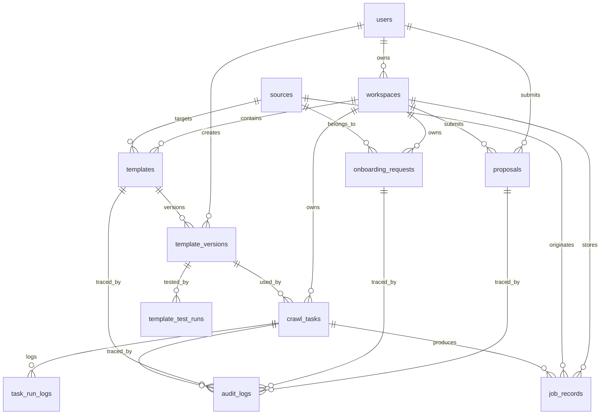

# 数据库设计文档（V1 正式版）

## 1. 文档目标

本文档用于将 NetWorkspace 的数据库设计从概念草案推进到可直接指导后端建模、迁移和 API 设计的正式版本。

本文档覆盖：

1. 核心实体与关系
2. 字段级定义
3. 主键、外键、唯一约束
4. 索引建议
5. 状态枚举建议
6. 迁移顺序建议

## 2. 设计目标

数据库需要同时支撑以下能力：

1. 多用户、多工作区隔离
2. 多站点、多模板、多版本
3. 采集任务异步执行与日志追踪
4. 原始数据保留与结构化数据分析
5. AI / Agent 生成、修复和审计
6. 个人能力提案与官方审核

## 3. 设计原则

### 3.1 原始数据与结构化数据并存

不能只保留结构化字段，也不能只保留原始 JSON。

- 原始数据用于回溯、重解析、审计
- 结构化字段用于搜索、统计、分析、可视化

### 3.2 工作区隔离优先

所有个人模板、任务、记录、Agent 行为必须可追溯到某个工作区。

### 3.3 版本化优先

模板、模板测试、提案、审计日志都必须支持版本追踪。

### 3.4 分析友好优先

岗位记录中的关键字段不能只存字符串，应尽量结构化，例如：

- `salary_min`
- `salary_max`
- `salary_period`
- `publish_date`
- `captured_at`
- `first_seen_at`
- `last_seen_at`

### 3.5 状态流转明确

模板、任务、提案、接入流程都要有状态字段，避免仅靠日志推断过程。

## 4. 核心实体总览

V1 建议包含以下核心实体：

- `users`
- `workspaces`
- `sources`
- `templates`
- `template_versions`
- `onboarding_requests`
- `template_test_runs`
- `crawl_tasks`
- `task_run_logs`
- `job_records`
- `proposals`
- `audit_logs`

V1 可预留但不强制落地：

- `knowledge_documents`
- `search_histories`
- `export_records`
- `agent_sessions`
- `agent_actions`

## 5. ER 图

## 6. 表设计

下面字段类型以 PostgreSQL 为主要参考；若使用 MySQL 8，可做等价映射。

---

### 6.1 `users`

用途：存储用户基础信息、认证信息和系统角色。

| 字段 | 类型 | 约束 | 说明 |
| --- | --- | --- | --- |
| `id` | `bigserial` | PK | 用户主键 |
| `username` | `varchar(50)` | unique, not null | 用户名 |
| `email` | `varchar(255)` | unique, not null | 邮箱 |
| `password_hash` | `varchar(255)` | not null | 密码哈希 |
| `role` | `varchar(32)` | not null | 系统角色 |
| `status` | `varchar(32)` | not null | 账户状态 |
| `created_at` | `timestamptz` | not null | 创建时间 |
| `updated_at` | `timestamptz` | not null | 更新时间 |

建议枚举：

- `role`: `admin` / `user` / `reviewer`
- `status`: `active` / `suspended` / `deleted`

索引建议：

- unique(`username`)
- unique(`email`)
- index(`role`, `status`)

---

### 6.2 `workspaces`

用途：每个用户的独立工作区，是个性化配置与隔离的核心边界。

| 字段 | 类型 | 约束 | 说明 |
| --- | --- | --- | --- |
| `id` | `bigserial` | PK | 工作区主键 |
| `user_id` | `bigint` | FK, not null | 所属用户 |
| `name` | `varchar(100)` | not null | 工作区名称 |
| `slug` | `varchar(100)` | unique, not null | 工作区唯一标识 |
| `description` | `text` | null | 描述 |
| `status` | `varchar(32)` | not null | 工作区状态 |
| `created_at` | `timestamptz` | not null | 创建时间 |
| `updated_at` | `timestamptz` | not null | 更新时间 |

外键：

- `user_id -> users.id`

建议枚举：

- `status`: `active` / `archived`

索引建议：

- index(`user_id`)
- unique(`slug`)

---

### 6.3 `sources`

用途：描述网站来源本身，而不是具体模板版本。

| 字段 | 类型 | 约束 | 说明 |
| --- | --- | --- | --- |
| `id` | `bigserial` | PK | 来源站点主键 |
| `source_name` | `varchar(100)` | not null | 站点显示名 |
| `domain` | `varchar(255)` | not null | 主域名 |
| `source_type` | `varchar(32)` | not null | 来源类型 |
| `content_type` | `varchar(32)` | not null | 内容类型 |
| `site_locale` | `varchar(32)` | null | 站点语言区域 |
| `status` | `varchar(32)` | not null | 来源状态 |
| `created_at` | `timestamptz` | not null | 创建时间 |
| `updated_at` | `timestamptz` | not null | 更新时间 |

建议枚举：

- `source_type`: `job_site` / `company_site` / `content_site`
- `content_type`: `job` / `company` / `article`
- `status`: `active` / `inactive`

索引建议：

- unique(`domain`)
- index(`source_type`, `status`)

---

### 6.4 `templates`

用途：模板主对象，用于管理模板归属、作用域和当前版本。

| 字段 | 类型 | 约束 | 说明 |
| --- | --- | --- | --- |
| `id` | `bigserial` | PK | 模板主键 |
| `workspace_id` | `bigint` | FK, null | 所属工作区，官方模板可为空 |
| `source_id` | `bigint` | FK, not null | 所属来源站点 |
| `template_name` | `varchar(100)` | not null | 内部模板名 |
| `display_name` | `varchar(150)` | not null | 展示名称 |
| `template_scope` | `varchar(32)` | not null | 模板作用域 |
| `status` | `varchar(32)` | not null | 模板状态 |
| `current_version_id` | `bigint` | FK, null | 当前生效版本 |
| `created_at` | `timestamptz` | not null | 创建时间 |
| `updated_at` | `timestamptz` | not null | 更新时间 |

外键：

- `workspace_id -> workspaces.id`
- `source_id -> sources.id`
- `current_version_id -> template_versions.id`  
  注意：建表时建议后置添加该外键，避免循环依赖问题。

建议枚举：

- `template_scope`: `official` / `personal` / `proposal`
- `status`: `draft` / `active` / `inactive` / `archived`

约束建议：

- unique(`workspace_id`, `template_name`) for personal templates
- unique(`source_id`, `template_name`, `template_scope`)

索引建议：

- index(`workspace_id`)
- index(`source_id`)
- index(`template_scope`, `status`)

---

### 6.5 `template_versions`

用途：模板版本表，存储 DSL 内容、生成来源、创建信息和置信度。

| 字段 | 类型 | 约束 | 说明 |
| --- | --- | --- | --- |
| `id` | `bigserial` | PK | 模板版本主键 |
| `template_id` | `bigint` | FK, not null | 所属模板 |
| `version` | `varchar(32)` | not null | 版本号 |
| `dsl_content` | `jsonb` | not null | DSL 正文 |
| `generation_source` | `varchar(32)` | not null | 生成来源 |
| `confidence_level` | `varchar(16)` | null | 置信度等级 |
| `change_summary` | `text` | null | 变更摘要 |
| `created_by_user_id` | `bigint` | FK, null | 创建人 |
| `created_at` | `timestamptz` | not null | 创建时间 |

外键：

- `template_id -> templates.id`
- `created_by_user_id -> users.id`

建议枚举：

- `generation_source`: `manual` / `agent` / `repair`
- `confidence_level`: `low` / `medium` / `high`

约束建议：

- unique(`template_id`, `version`)

索引建议：

- index(`template_id`)
- index(`generation_source`)

---

### 6.6 `onboarding_requests`

用途：记录“用户提交链接，系统自动接入”的全过程状态。

| 字段 | 类型 | 约束 | 说明 |
| --- | --- | --- | --- |
| `id` | `bigserial` | PK | 接入请求主键 |
| `workspace_id` | `bigint` | FK, not null | 所属工作区 |
| `source_id` | `bigint` | FK, null | 识别出的来源站点 |
| `submitted_by_user_id` | `bigint` | FK, not null | 提交用户 |
| `target_url` | `text` | not null | 用户提交的目标链接 |
| `content_type_hint` | `varchar(32)` | null | 用户提示内容类型 |
| `status` | `varchar(32)` | not null | 当前状态 |
| `site_guess` | `varchar(64)` | null | 系统猜测站点类型 |
| `render_mode_guess` | `varchar(32)` | null | 渲染方式猜测 |
| `risk_flags` | `jsonb` | null | 风险标记列表 |
| `analysis_summary` | `jsonb` | null | 分析摘要 |
| `published_template_id` | `bigint` | FK, null | 成功发布后关联模板 |
| `created_at` | `timestamptz` | not null | 创建时间 |
| `updated_at` | `timestamptz` | not null | 更新时间 |

外键：

- `workspace_id -> workspaces.id`
- `source_id -> sources.id`
- `submitted_by_user_id -> users.id`
- `published_template_id -> templates.id`

建议枚举：

- `status`:  
  `submitted` / `identified` / `analyzing` / `draft_generated` / `testing` / `awaiting_confirmation` / `published` / `failed` / `abandoned`

索引建议：

- index(`workspace_id`)
- index(`submitted_by_user_id`)
- index(`status`)

---

### 6.7 `template_test_runs`

用途：记录模板版本的小样本测试与验证结果。

| 字段 | 类型 | 约束 | 说明 |
| --- | --- | --- | --- |
| `id` | `bigserial` | PK | 测试记录主键 |
| `template_version_id` | `bigint` | FK, not null | 被测试模板版本 |
| `onboarding_request_id` | `bigint` | FK, null | 若来自接入流程则关联 |
| `test_url` | `text` | not null | 测试 URL |
| `test_status` | `varchar(32)` | not null | 测试状态 |
| `sample_size` | `integer` | not null default 0 | 抽样数 |
| `items_found` | `integer` | not null default 0 | 识别记录数 |
| `detail_success_rate` | `numeric(5,4)` | null | 详情成功率 |
| `field_completeness` | `jsonb` | null | 字段完整率 |
| `sample_result` | `jsonb` | null | 抽样结果 |
| `error_summary` | `text` | null | 错误摘要 |
| `created_at` | `timestamptz` | not null | 创建时间 |

外键：

- `template_version_id -> template_versions.id`
- `onboarding_request_id -> onboarding_requests.id`

建议枚举：

- `test_status`: `pending` / `running` / `passed` / `failed`

索引建议：

- index(`template_version_id`)
- index(`onboarding_request_id`)
- index(`test_status`)

---

### 6.8 `crawl_tasks`

用途：记录正式采集任务。

| 字段 | 类型 | 约束 | 说明 |
| --- | --- | --- | --- |
| `id` | `bigserial` | PK | 任务主键 |
| `workspace_id` | `bigint` | FK, not null | 所属工作区 |
| `template_version_id` | `bigint` | FK, not null | 使用的模板版本 |
| `created_by_user_id` | `bigint` | FK, not null | 创建人 |
| `task_name` | `varchar(150)` | not null | 任务名称 |
| `task_status` | `varchar(32)` | not null | 任务状态 |
| `task_params` | `jsonb` | not null | 用户输入参数 |
| `schedule_type` | `varchar(32)` | null | 调度类型 |
| `scheduled_at` | `timestamptz` | null | 计划时间 |
| `started_at` | `timestamptz` | null | 开始时间 |
| `finished_at` | `timestamptz` | null | 结束时间 |
| `total_records` | `integer` | not null default 0 | 任务产出条数 |
| `error_summary` | `text` | null | 错误摘要 |
| `created_at` | `timestamptz` | not null | 创建时间 |

外键：

- `workspace_id -> workspaces.id`
- `template_version_id -> template_versions.id`
- `created_by_user_id -> users.id`

建议枚举：

- `task_status`: `pending` / `queued` / `running` / `completed` / `failed` / `cancelled`
- `schedule_type`: `manual` / `scheduled`

索引建议：

- index(`workspace_id`)
- index(`template_version_id`)
- index(`task_status`)
- index(`scheduled_at`)

---

### 6.9 `task_run_logs`

用途：记录任务运行过程日志，便于调试和审计。

| 字段 | 类型 | 约束 | 说明 |
| --- | --- | --- | --- |
| `id` | `bigserial` | PK | 日志主键 |
| `task_id` | `bigint` | FK, not null | 所属任务 |
| `log_level` | `varchar(16)` | not null | 日志等级 |
| `event_type` | `varchar(64)` | not null | 事件类型 |
| `message` | `text` | not null | 日志内容 |
| `payload` | `jsonb` | null | 结构化附加信息 |
| `created_at` | `timestamptz` | not null | 创建时间 |

外键：

- `task_id -> crawl_tasks.id`

建议枚举：

- `log_level`: `debug` / `info` / `warning` / `error`

索引建议：

- index(`task_id`)
- index(`log_level`)
- index(`event_type`)

---

### 6.10 `job_records`

用途：存储结构化岗位数据，是搜索、分析和可视化的核心表。

| 字段 | 类型 | 约束 | 说明 |
| --- | --- | --- | --- |
| `id` | `bigserial` | PK | 岗位记录主键 |
| `workspace_id` | `bigint` | FK, not null | 所属工作区 |
| `task_id` | `bigint` | FK, not null | 来源任务 |
| `source_id` | `bigint` | FK, not null | 来源站点 |
| `source_job_id` | `varchar(255)` | null | 来源站点岗位 ID |
| `job_url` | `text` | not null | 岗位链接 |
| `job_title` | `varchar(255)` | not null | 岗位标题 |
| `job_category` | `varchar(100)` | null | 岗位分类 |
| `company_name` | `varchar(255)` | null | 公司名 |
| `city` | `varchar(100)` | null | 城市 |
| `education` | `varchar(100)` | null | 学历 |
| `experience_text` | `varchar(100)` | null | 经验文本 |
| `salary_text` | `varchar(100)` | null | 原始薪资文本 |
| `salary_min` | `numeric(12,2)` | null | 最低薪资 |
| `salary_max` | `numeric(12,2)` | null | 最高薪资 |
| `salary_currency` | `varchar(16)` | null | 币种 |
| `salary_period` | `varchar(32)` | null | 薪资周期 |
| `publish_date` | `date` | null | 发布日期 |
| `job_description` | `text` | null | 岗位描述 |
| `captured_at` | `timestamptz` | not null | 本次抓取时间 |
| `first_seen_at` | `timestamptz` | not null | 首次发现时间 |
| `last_seen_at` | `timestamptz` | not null | 最近一次发现时间 |
| `is_active` | `boolean` | not null default true | 是否仍视为有效 |
| `raw_data` | `jsonb` | not null | 原始记录 |
| `created_at` | `timestamptz` | not null | 创建时间 |

外键：

- `workspace_id -> workspaces.id`
- `task_id -> crawl_tasks.id`
- `source_id -> sources.id`

建议枚举：

- `salary_period`: `day` / `month` / `year` / `hour` / `unknown`

约束与去重建议：

- 若存在稳定 ID：unique(`workspace_id`, `source_id`, `source_job_id`)
- 若无稳定 ID：使用业务层生成指纹，不建议仅靠数据库复合唯一约束硬抗所有情况

索引建议：

- index(`workspace_id`)
- index(`task_id`)
- index(`source_id`)
- index(`job_title`)
- index(`company_name`)
- index(`city`)
- index(`education`)
- index(`publish_date`)
- index(`captured_at`)
- index(`is_active`)
- 可选全文索引：`job_title + job_description`

---

### 6.11 `proposals`

用途：个人模板或能力升级为共享能力的提案记录。

| 字段 | 类型 | 约束 | 说明 |
| --- | --- | --- | --- |
| `id` | `bigserial` | PK | 提案主键 |
| `workspace_id` | `bigint` | FK, not null | 所属工作区 |
| `submitted_by_user_id` | `bigint` | FK, not null | 提交用户 |
| `proposal_type` | `varchar(32)` | not null | 提案类型 |
| `target_type` | `varchar(32)` | not null | 提案目标类型 |
| `target_id` | `bigint` | not null | 提案目标 ID |
| `title` | `varchar(255)` | not null | 标题 |
| `description` | `text` | null | 说明 |
| `review_status` | `varchar(32)` | not null | 审核状态 |
| `reviewed_by_user_id` | `bigint` | FK, null | 审核人 |
| `review_comment` | `text` | null | 审核意见 |
| `created_at` | `timestamptz` | not null | 创建时间 |
| `updated_at` | `timestamptz` | not null | 更新时间 |

外键：

- `workspace_id -> workspaces.id`
- `submitted_by_user_id -> users.id`
- `reviewed_by_user_id -> users.id`

建议枚举：

- `proposal_type`: `share_template` / `share_dashboard` / `share_workflow`
- `target_type`: `template` / `template_version` / `dashboard`
- `review_status`: `pending` / `approved` / `rejected`

索引建议：

- index(`workspace_id`)
- index(`submitted_by_user_id`)
- index(`review_status`)

---

### 6.12 `audit_logs`

用途：记录系统关键对象变化，支撑审计、回滚和透明展示。

| 字段 | 类型 | 约束 | 说明 |
| --- | --- | --- | --- |
| `id` | `bigserial` | PK | 审计日志主键 |
| `workspace_id` | `bigint` | FK, null | 关联工作区 |
| `actor_type` | `varchar(32)` | not null | 操作者类型 |
| `actor_id` | `bigint` | null | 操作者 ID |
| `action` | `varchar(64)` | not null | 行为 |
| `target_type` | `varchar(64)` | not null | 目标对象类型 |
| `target_id` | `bigint` | not null | 目标对象 ID |
| `before_snapshot` | `jsonb` | null | 变更前快照 |
| `after_snapshot` | `jsonb` | null | 变更后快照 |
| `metadata` | `jsonb` | null | 附加上下文 |
| `created_at` | `timestamptz` | not null | 创建时间 |

外键：

- `workspace_id -> workspaces.id`

建议枚举：

- `actor_type`: `user` / `agent` / `system`

索引建议：

- index(`workspace_id`)
- index(`actor_type`, `actor_id`)
- index(`target_type`, `target_id`)
- index(`action`)

## 7. 关系说明

### 7.1 用户与工作区

- 一个用户可以拥有多个工作区
- 一个工作区只属于一个用户

### 7.2 来源站点与模板

- 一个站点可以有多个模板
- 一个模板只面向一个来源站点
- 一个模板可以有多个版本

### 7.3 接入流程与模板

- 一个接入请求可能最终产出一个模板
- 一个模板版本可以被多次测试

### 7.4 模板与采集任务

- 一个模板版本可以被多个采集任务复用
- 一个采集任务只绑定一个模板版本

### 7.5 采集任务与岗位记录

- 一个采集任务会产出多条岗位记录
- 一条岗位记录必须能追溯到它所属的任务

## 8. 状态枚举汇总

为避免状态含义漂移，建议在代码中统一定义状态枚举。

### 8.1 模板状态

- `draft`
- `active`
- `inactive`
- `archived`

### 8.2 接入请求状态

- `submitted`
- `identified`
- `analyzing`
- `draft_generated`
- `testing`
- `awaiting_confirmation`
- `published`
- `failed`
- `abandoned`

### 8.3 模板测试状态

- `pending`
- `running`
- `passed`
- `failed`

### 8.4 任务状态

- `pending`
- `queued`
- `running`
- `completed`
- `failed`
- `cancelled`

### 8.5 提案审核状态

- `pending`
- `approved`
- `rejected`

## 9. PostgreSQL / MySQL 适配建议

### 9.1 PostgreSQL 优先

如果可以优先选择 PostgreSQL，原因：

- `jsonb` 更成熟
- 索引能力更强
- 后续全文检索和分析扩展更方便

### 9.2 若使用 MySQL 8

建议注意：

- `jsonb` 改为 `json`
- `timestamptz` 映射为 `datetime` 或 `timestamp`
- 全文索引能力需单独评估

## 10. 迁移顺序建议

建议 Alembic / SQL 迁移顺序如下：

1. `users`
2. `workspaces`
3. `sources`
4. `templates`
5. `template_versions`
6. 回填 `templates.current_version_id` 外键
7. `onboarding_requests`
8. `template_test_runs`
9. `crawl_tasks`
10. `task_run_logs`
11. `job_records`
12. `proposals`
13. `audit_logs`

## 11. V1 后续可扩展表

### 11.1 `knowledge_documents`

用于平台知识库和工作区知识库。

### 11.2 `search_histories`

用于保存搜索条件和用户分析习惯。

### 11.3 `export_records`

用于记录导出行为和导出文件信息。

### 11.4 `agent_sessions` / `agent_actions`

用于更细粒度记录 Agent 对话和动作链。

## 12. 结论

V1 正式数据库结构的关键在于：

1. 以 `workspace` 作为隔离边界
2. 以 `template + template_version` 作为接入与采集基础
3. 以 `crawl_task + task_run_log + job_record` 作为执行与数据闭环
4. 以 `proposal + audit_log` 作为平台演化与透明机制支撑

这套结构已经足以支撑：

- 智能站点接入
- 模板版本化
- 异步采集
- 历史数据沉淀
- 搜索和趋势分析
- 用户个性化工作区
- 管理员审核与平台升级
